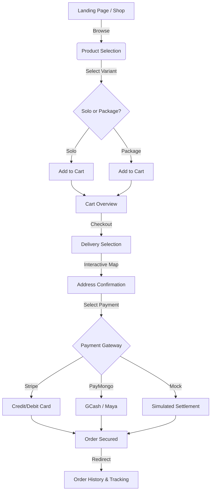
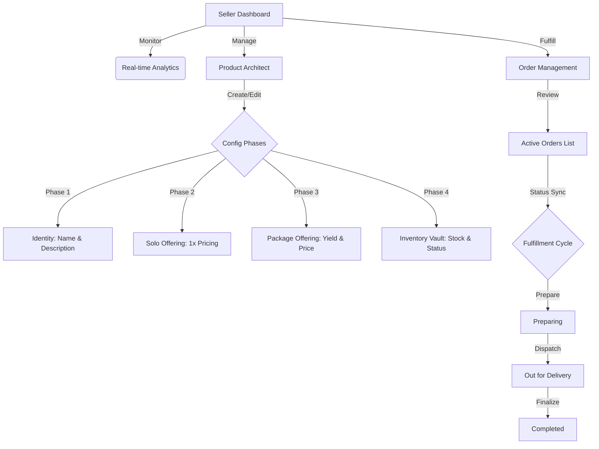

# Kokommerce: System Architecture & User Flow Documentation

Welcome to the **Kokommerce** documentation. This guide outlines the intricate flows of our artisanal marketplace, designed with the **Artisanal Vault** aesthetic. This document serves as a roadmap for both the Buyer Experience and the Seller Stewardship modules.

---

## 1. Buyer Journey Flow

The Buyer journey is designed for seamless discovery and secure settlement of artisanal goods.

### Flowchart: Buyer Experience

### Key Buyer Modules:
- **Shop Architecture**: A high-fidelity grid displaying artisanal products with real-time stock status.
- **Cart Management**: Dynamic calculation of subtotals and itemized lists.
- **Delivery & Maps**: Integrated Leaflet.js map for precise localization of deliveries.
- **Payment Settlement**: A multi-channel payment bridge supporting international (Stripe) and local (PayMongo) providers, plus a specialized **Mock E-Wallet** for testing environments.
- **Order History**: A dedicated narrative space where buyers can track their orders from "Pending" to "Completed".

---

## 2. Seller Stewardship Flow

The Seller interface is the command center for inventory management and order fulfillment.

### Flowchart: Seller Operations

### Key Seller Modules:
- **Product Architect (Artisanal Vault)**:
    - **Collective Yield**: A dynamic configuration tool that connects the "Package Master Format" to the "Effective Unit Price". It ensures that sellers can define exactly how many units (e.g., 12 pcs in a Bilao) are included in a package for real-time price-per-unit detection.
    - **Inventory Stewardship**: A real-time vault synchronization tool for restocking and managing visibility (In Stock, Pre-Order, Sold Out).
- **Order Management**: A standardized list where sellers can oversee the entire fulfillment lifecycle, from urgent pending requests to finalized deliveries.
- **Analytics Dashboard**: High-fidelity charts (Hourly, Daily, Weekly, Monthly) providing insights into revenue trends and customer signups.

---

## 3. Core System Features

### Connect & Detect: Collective Yield
One of the system's most advanced features is the **Collective Yield** synchronization. 
- **The Problem**: Sellers often struggle to calculate the real value of a "Package" (e.g., a tray of 24 cookies vs a single cookie).
- **The Solution**: In the Product Architect, entering a `Package Price` and a `Collective Yield` (quantity) automatically generates the **Effective Unit Price**. 
- **Real-time Detection**: The UI immediately updates the price preview as the seller types, ensuring logistical integrity before committing to the vault.

### Artisanal Design Language
The entire system utilizes the **Artisanal Vault** palette:
- **Primary**: Gold/Amber accents (`#eca840`) symbolizing premium quality.
- **Backgrounds**: Sleek white and light-gray layers for a clean, professional "Refined Masterpiece" aesthetic.
- **Interactions**: Glassmorphism, smooth gradients, and micro-animations to provide a "Wow" factor at every step.

---

## 4. Technical Stack
- **Frontend**: React + Inertia.js + TailwindCSS.
- **Backend**: Laravel PHP.
- **Database**: MySQL with specialized `ActivityLog` and `Notification` triggers.
- **Payment Gateway**: Stripe API & PayMongo API Integration.
- **Localization**: Leaflet.js for mapping.

---
*Documentation Version: 1.1.0*  
*Last Updated: May 2026*
